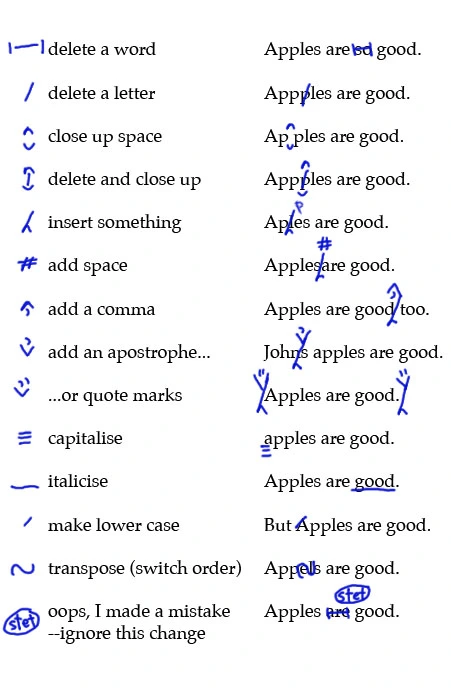
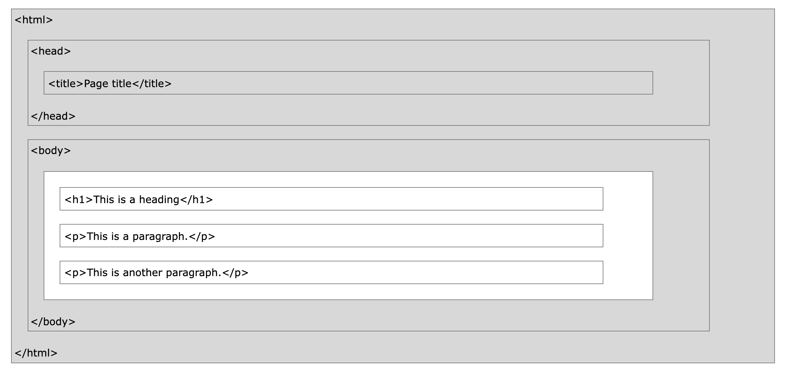
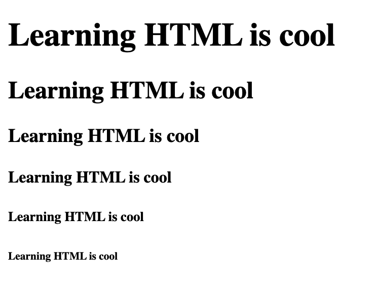

# 01: HTML Introduction

Use this [link](https://creating-coding-careers.gitbook.io/the-basics/) to follow along on GitBook

## What is HTML?

There are 3 main tools that are used when creating websites. They are **HTML, CSS, and JavaScript**. HTML is the foundation of all websites, and provides the structure for the content on the website.


The image above is an example of the role that each of these tools play.

HTML stands for Hyper Text Markup Language and can be considered the skeleton or the structure of the website. Without this, nothing else can exist or would have any relevance.

CSS stand for Cascading Style Sheets and it provides the rules for how each piece of content is styled. For example, the boy's brown hair, blue eyes, red shirt, etc, would be considered CSS.

JavaScript provides the functionality on a website. In our example that functionality would be the ollie. JavaScript is what we use to take our websites to the next level.

For now we'll just focus on HTML. So what is HTML...

- HTML stands for Hyper Text Markup Language
- HTML is the standard markup language for creating Web pages
- HTML describes the structure of a Web page
- HTML consists of a series of elements
- HTML elements tell the browser how to display the content
- HTML elements label pieces of content such as "this is a heading", "this is a paragraph", "this is a link", etc.

Fun Fact:

*The "Markup" in HTML is based on the mark up that was put in manuscripts. Editors would "mark up" the manuscript to specify structure and layout to the publishers or changes to the author.*



```html
<!DOCTYPE html>
<html>
<head>
<title>Page Title</title>
</head>
<body>

<h1>My First Heading</h1>
<p>My first paragraph.</p>

</body>
</html>
```

## Example Explained

The ```<!DOCTYPE html>``` declaration defines that this document is an HTML5 document
The ```<html>``` element is the root element of an HTML page
The ```<head>``` element contains meta information about the HTML page
The ```<title>``` element specifies a title for the HTML page (which is shown in the browser's title bar or in the page's tab)
The ```<body>``` element defines the document's body, and is a container for all the visible contents, such as headings, paragraphs, images, hyperlinks, tables, lists, etc.
The ```<h1>``` element defines a large heading
The ```<p>``` element defines a paragraph

## What is an HTML Element?

An HTML element is defined by a start tag, some content, and an end tag:

```<tagname>```Content goes here...```</tagname>```
The HTML element is everything from the start tag to the end tag:

```<h1>```My First Heading```</h1>```
```<p>```My first paragraph.```</p>```

## Web Browsers

The purpose of a web browser (Chrome, Edge, Firefox, Safari) is to read HTML documents and display them correctly.

A browser does not display the HTML tags, but uses them to determine how to display the document:


## HTML Page Structure

Below is a visualization of an HTML page structure:



Note: The content inside the ```<body>``` section (the white area above) will be displayed in a browser. The content inside the ```<title>``` element will be shown in the browser's title bar or in the page's tab.

---

## What is the Document Object Model?

The Document Object Model (DOM) is a programming API for HTML and XML documents. It defines the logical structure of documents and the way a document is accessed and manipulated. In the DOM specification, the term "document" is used in the broad sense - increasingly, XML is being used as a way of representing many different kinds of information that may be stored in diverse systems, and much of this would traditionally be seen as data rather than as documents. Nevertheless, XML presents this data as documents, and the DOM may be used to manage this data.

With the Document Object Model, programmers can create and build documents, navigate their structure, and add, modify, or delete elements and content. Anything found in an HTML or XML document can be accessed, changed, deleted, or added using the Document Object Model, with a few exceptions - in particular, the DOM interfaces for the internal subset and external subset have not yet been specified.

## The Document Object Model

The Document Object Model is a programming API for documents. The object model itself closely resembles the structure of the documents it models. For instance, consider this table, taken from an HTML document:

```html
<TABLE>
      <TR> 
      <TD>Shady Grove</TD>
      <TD>Aeolian</TD> 
      </TR> 
      <TR>
      <TD>Over the River, Charlie</TD>
      <TD>Dorian</TD> 
      </TR> 
      </TABLE>
```

The Document Object Model represents this table like this:


---

## Setup A Simple Website

1). Go to [Code Pen](https://codepen.io/)

2). Sign Up (not necessary, but you can't save your code without creating an account)

3). Once you're signed up and logged in Click Pen

4). New Pen.

<!-- 1). Create a new folder;

```sh
mkdir mySimpleSite
```

2). Change directory into the new folder:

```sh
cd mySimpleSite
```

3). Create a `index.html` file from the terminal, using the following command.

```sh
touch index.html
```

4). Open VS Code in the current folder.

```sh
code .
``` -->

5). Paste the following code in the ```HTML``` file.

```html
<!DOCTYPE html>
<html> 

</html>
```

The first line tells the browser that this is an HTML5 document, while the next line tells
the browser that everything inside it is HTML.

6). Modify the ```index.html``` file by adding  ```<head></head>``` and ```<body></body>``` tags inside the ```<html></html>``` tags. I should look like this.

```html
<!DOCTYPE html>
<html> 
    <head>

    </head>
    <body>

    </body>
</html>
```

*The ```<head></head>``` tag contains information about the website while the ```<body></body>``` tag is the main content of the page.*

7). Let's add a sentence inside the ```<body></body>``` tag.

```html
<!DOCTYPE html>
<html> 
    <head>

    </head>
    <body>
        Learning HTML is fun!
    </body>
</html>
```

8). Your code should display automatically in the on the page.

*Notice the HTML tags aren't visible, only the content.*

---

<!-- ## Commit your work

1). Initialize a version control (git) for your project.

```sh
git init
```

2). Add your initial files

```sh
git add .
git commit -m "adds initial files"
```

--- -->

## Head Tags

There are many tags that can be added inside the  ```<head></head>``` and ```<body></body>```tags in order to add content to your page. Let's cover a few.

1). Add the following inside the ```<head></head>``` tag.

```html
<meta charset="utf-8">
```

UTF-8 is a type of unicode encoding used in virtually all websites around the world. This is how computer translates the charters we use into bytes. *You don't need to memorize this.*

2). Add the following inside the ```<head></head>``` tag.

```html
<title>A Simple Site</title>
```

3). Refresh your browser. Do you see the title in browser tab?

---

## Body Tags

Let’s look first at the headline or header tags, designated with the letter H. Each H tag also has a number after the H. They range from ```<h1>``` to ```<h6>```.
The  ```<h1>``` tag is the highest in priority. It’s generally used for the title of the page.

1). Let's create an ```<h1>``` tag and place our text from earlier, between the opening and closing tags. It should look like this.

```html
<h1>Learning HTML is cool</h1>
```

2). Now duplicate it 5 more times, except with using the ```<h2>``` to ```<h6>``` tags. It should look like this.



The next tag we’re gonna look at is the paragraph, or  ```<p>``` tag. You can create a paragraph by surrounding your content with the ```<p>``` tags.

3). Create a ```<p>```tag and add the following to it.

```text
Lorem ipsum dolor sit amet, consectetur adipiscing elit. 
   Nullam facilisis arcu vel mollis finibus. Nunc facilisis 
   vel nisl lacinia cursus. Cras suscipit augue sed volutpat 
   tincidunt. Aenean dictum tincidunt urna, quis eleifend 
   quam mattis eu. Integer sollicitudin, nisl faucibus aliquam 
   ullamcorper, metus sapien scelerisque lorem, at ornare dui 
   orci non orci. Integer tempus consectetur metus, vitae 
   blandit nibh aliquam nec. Pellentesque vestibulum arcu eget 
   ante sollicitudin, id accumsan dui molestie. Suspendisse 
   vehicula semper dui id congue. Suspendisse sed velit sit 
   amet velit luctus varius. Ut condimentum tincidunt consequat. 
   Sed eu ligula non magna scelerisque auctor.
```

4). Add another ```<p>```tag and add the following to it.

```text
Maecenas feugiat iaculis imperdiet. Duis vitae pellentesque 
   nunc, eget elementum metus. Nulla sollicitudin bibendum nibh, 
   sit amet semper tortor. Nunc rhoncus non arcu in scelerisque. 
   Donec magna mauris, congue ac dignissim rutrum, tincidunt 
   quis leo. Maecenas dictum orci in magna iaculis, in elementum 
   felis viverra. Aenean sit amet sapien odio. Donec molestie 
   est et nisl mattis dictum. Nullam at nibh aliquet, tincidunt 
   lorem et, facilisis enim. Praesent id felis sit amet quam 
   dignissim volutpat. Nam nec cursus mi, quis tincidunt justo.
```

What does it look like in your browser?

---

## Style tags

The next set of tags we’re going to look at are style tags– these tags add styles to the text.

Let’s go through each of the style tags:

The `<b>` tag makes text bold.
The `<i>` tag makes text italic.
The `<u>` tag makes text underlined.
The `<em>` (emphasized) tag is usually interpreted as italics in browsers.
And the `<strong>` tag will usually be bold text.

1. Make the first paragraph bold.
2. Make the second paragraph italics.
3. Underline the second line of the second paragraph

---

## Anchor Link

Links are one of the main ways that we get around the internet. The link tag is written as an ```<a>``` tag. That A stands for “anchor,” because the link connects the two websites like a boat anchor connects the boat to whatever it’s anchoring to.

To create a link, first you put the ```<a>``` tag around the link text that you want to be clickable.
Aside from just the tag itself, the ```<a>``` tag requires an attribute, which means additional information inside the opening tag.

### Attributes

The attribute it uses is the href attribute. This is is short for hypertext reference. And the value is the URL of the destination website.

1). Add an ```<a>``` tag around the words Lorem ipsum, and set the value of the href= to ```"https://www.google.com/"```.

```html
<a href="https://www.google.com/">Lorem ipsum</a>

```

2). Refresh the browser then click the link.

3). Use the back button to go back to your website.

Another often used attribute in the ```<a>``` tag is “target.” This controls if the link that you click will open in the same page, or open in a new page or tab in your browser.

By default it will open the link in the same page. If you want the link to open in a new page, set target to “_blank.”

4). Add the attribute target to the ```<a>``` tag, and set the value to ```"_blank"```. It should look like the this.

```html
<a href="https://www.google.com/" target="_blank">Lorem ipsum</a>
```

5). Refresh the browser then click the link.

Notice, this time it open in a different tab

6). Modify the first word in the second paragrah ```Maecenas```, so that it is a link that opens ```"https://www.yahoo.com/"``` in a new tab.

---

## Lists

The next thing we’re going to look at is lists. HTML can create bulleted or numbered lists pretty easily.

Bulleted lists are called unordered lists, as opposed to the ordered lists that use numbers.

To create a list you’ll use the list tag– either ```<ol>``` or ```<ul>``` depending on if you’re making an ordered or unordered list.

We’re going to make an unordered list, of different types of fruits.

We’ll make our ```<ul>``` tag for the list.

Inside the list tag you’ll put your list items. Each item will go inside its own list item tag, written as ```<li>```.

1. Create an unordered list that contains the following, (apples, oranges, pinappples, mangoes,dragonfruit.)

2. Refresh the broswer.

3. Create an ordered list that contains the following, (First, Second, Third, Fourth, Fifth)

4. Refresh the broswer.

## Table

To start, we’ll first need a ```<table>``` tag. Everything else in the table will be inside this tag.

Inside the table we’ll have table rows, table cells, and table headers for the column headers.

Then we’ll add in the first table row, using the ```<tr>``` tag.

```html
<table>
   <tr></tr>
</table>
```

Inside this row we’ll want to put the column headers. We can do this by using the ```<th>``` — table header — tags. By default the table headers are bold text and also centered within the cell.

1. Using this syntax, create 6 table headers called (Month, Rent, Utilities, Groceries, Eating Out, Entertainment)

2. Then in the next row, we’ll add some data for the month of August. Since these are not headers, we will use the ```<td>``` tag, for table data.
Let’s say our rent each month is $1500. $150 for utilities, $350 for groceries, $100 for eating out, and $50 for entertainment.

## Push to Github

1. Add your files.

2. Make your commit.

3. Create a repository on Github.

4. Follow the steps provided.

## Bonus

Style the table by adding a border of "1" and cellpadding of "10".

[Coding Rooms](https://app.codingrooms.com/app?joinCode=C-6dRxGQT)
