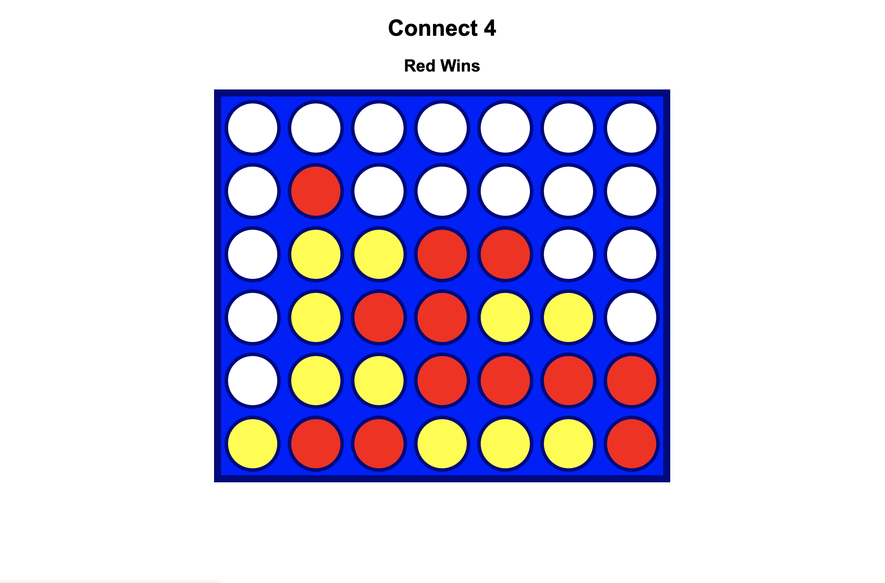

# EXERCISE 07: Connect 4 Workshop

## Description

This exercise will walk you through building the game Connect 4. In addition to providing the code necessary to build the game, you will also be provided and explanation for the HTML and CSS.



---

### Setup

1. Go to [codepen.io](https://codepen.io/trending) and click on Pen.

Awesome.Now let's get started.

### Steps

1). Let start by adding some HTML. Copy and paste the following code snippet into the area on Code Pen, labeled `HTML`.

```html
<head>
    <meta charset="UTF-8">
    <meta http-equiv="X-UA-Compatible" content="IE=edge">
    <meta name="viewport" content="width=device-width, initial-scale=1.0, user-scalable=no">
</head>
<body>
    <h1></h1>
    <h2 id="winner"></h2>
    <div id="board"></div>
    <section class="controls">
      <button id="reset">Reset</button>
    </section>
</body>
```

Let's review some of the elements used in this code snippet.

### Head Element

```html
<head>

</head>
```

The `<head>` element is a container for metadata. Metadata is simply data about data. The `<head>` is placed between the `<html>` element and the `<body>` element.

The metadata included, is data about the HTML document. Notice that the metadata is not displayed.

Metadata typically define the document title, character set, styles, scripts, and other meta information.

The following elements can go inside the `<head>` element:

```html

<title>
<style>
<base>
<link>
<meta>
<script>
<noscript>

```

---

### Body Element

```html
<body>

</body>
```

The `<body>` tag defines the document's body.

The `<body>` element contains all the contents of an HTML document, such as headings, paragraphs, images, hyperlinks, tables, lists, etc.

*Note: There can only be one `<body>` element in an HTML document.*

---

### Heading Element

```html
<h1></h1>
```

HTML `<h1>` to `<h6>` Tags

The `<h1>` to `<h6>` tags are used to define HTML headings.

`<h1>` defines the most important heading. `<h6>` defines the least important heading.

*Note: Only use one `<h1>` per page - this should represent the main heading/subject for the whole page. Also, do not skip heading levels - start with `<h1>`, then use `<h2>`, and so on.*

Add the text `Connect 4` to the the `<h1>` element.

It should look like this:

```html
<body>
    <h1>Connect 4</h1>
</body>
```

Good job!

---

### Div Element

```html
<div>

</div>
```

The `<div>` tag defines a division or a section in an HTML document.

The `<div>` tag is used as a container for HTML elements - which is then styled with CSS or manipulated with JavaScript.

The `<div>` tag is easily styled by using the class or id attribute.

Any sort of content can be put inside the `<div>` tag!

Note: By default, browsers always place a line break before and after the `<div>` element.

Our `<div>` element will be used for the Connect 4 board.

---

Now it's time to add our CSS. Copy and paste the following code snippet into the area on Code Pen, labeled `CSS`.

```css
body {
    font-family: Arial, Helvetica, sans-serif;
    text-align: center;
}

#board {
    height: 540px;
    width: 630px;
    background-color: blue;
    border: 10px solid navy;
    
    margin: 0 auto;
    display: flex;
    flex-wrap: wrap;
    
    cursor: pointer;
}

.tile {
    height: 70px;
    width: 70px;
    margin: 5px;

    /* Circle */
    background-color: white;
    border-radius: 50%;
    border: 5px solid navy;
}

.player1-piece {
    background-color: red;
}

.player2-piece {
    background-color: yellow;
}

.controls {
    display: flex;
    flex-direction: row;
    justify-content: center;
    align-items: center;
    margin-top: 1em;
}

.controls button {
    color: white;
    padding: 8px;
    border-radius: 8px;
    border: none;
    font-size: 20px;
    cursor: pointer;
}

.restart {
    background-color: #498AFB;
}

#reset {
    background-color: #FF3860;
}

```

The code snippet is our stlye sheet. It applies the style rules that we want to be set for each element. This includes, color, height, width, etc.

Lets add one more rule. Below the `.yellow-piece` rule, add the following code snippet:

```css
h1 {
    color: red;
}
```

**Try adding the following rules to the** `<h1>`

1. Change the font weight to bold.
2. Change the font family to font size to 2em.
3. Change the font family to monaco.

---

Now let's add the JS to take care of the rest. Copy and paste the following code snippet into the area on Code Pen, labeled `JS`.

```js
var player1Color = "Red";
var player2Color = "Yellow";
var currPlayer1 = true;

var gameOver = false;
var board;

var rows = 6;
var columns = 7;
var currColumns = []; //keeps track of which row each column is at.
var tiles = [];

window.onload = function() {
    setGame();
    const resetButton = document.querySelector('#reset');
    resetButton.addEventListener('click', resetGame);
}

function setGame() {
    board = [];
    currColumns = [5, 5, 5, 5, 5, 5, 5];

    for (let r = 0; r < rows; r++) {
        let row = [];
        for (let c = 0; c < columns; c++) {
            // JS
            row.push(' ');
            // HTML
            let tile = document.createElement("div");
            tile.id = r.toString() + "-" + c.toString();
            tile.classList.add("tile");
            tile.addEventListener("click", setPiece);
            document.getElementById("board").append(tile);
            tiles.push(tile);
        }
        board.push(row);
    }
}

function resetGame(){
    board = [...Array(rows)].map(row => new Array(columns));
    currColumns = [5, 5, 5, 5, 5, 5, 5];
    tiles.forEach(tile => {
      tile.classList.remove('player1-piece');
      tile.classList.remove('player2-piece');
    });
  
    currPlayer1 = true;
    gameOver = false;
    document.getElementById("winner").innerText = "";
}

function setPiece() {
    if (gameOver) {
        return;
    }

    //get coords of that tile clicked
    let coords = this.id.split("-");
    let r = parseInt(coords[0]);
    let c = parseInt(coords[1]);

    // figure out which row the current column should be on
    r = currColumns[c]; 

    if (r < 0) { // board[r][c] != ' '
        return;
    }

    board[r][c] = currPlayer1 ? player1Color : player2Color; //update JS board
    let tile = document.getElementById(r.toString() + "-" + c.toString());
    tile.classList.add(`player${currPlayer1 ? 1 : 2}-piece`);
  
    if (checkWinner(r, c, currPlayer1 ? player1Color : player2Color)) 
      setWinner(r, c);

    currPlayer1 = !currPlayer1;
    r -= 1; //update the row height for that column
    currColumns[c] = r; //update the array

}

function checkWinner(r, c, currentColor) {
  //List of directions a connect 4 can be made towards
  let dirs = [[1, 1], [1, 0], [1, -1], [0, 1]];
  //Check each direction
  if (dirs.some(dir => {
    let countF = 1, countB = 1;
    
    //Counts the number of forward spaces (stops at 4 since that's the win condition)
    //Note: "( ... || [])[...]" is used as a shortcut to handle out of index errors on accessing a multi-leveled array
    while(countF < 4 && (board[r + dir[0] * countF] || [])[c + dir[1] * countF] == currentColor)
      countF += 1;
    //Counts the number of backward spaces (stops at 4 (including forward count) since that's the win condition)
    while(countF + countB - 1 < 4 && (board[r - dir[0] * countB] || [])[c - dir[1] * countB] == currentColor)
      countB += 1;
    
    return countF + countB - 1 >= 4;
  })) setWinner();
}

function setWinner() {
    let winner = document.getElementById("winner");
    winner.innerText = (currPlayer1 ? player1Color : player2Color) +  " Wins";
    gameOver = true;
}
```

The JavaScript code snippet, handles all of the fuctionality of our game. Give it a try.

Feel free to make any chages to the code that you'd like, and don't forget to save your code.
