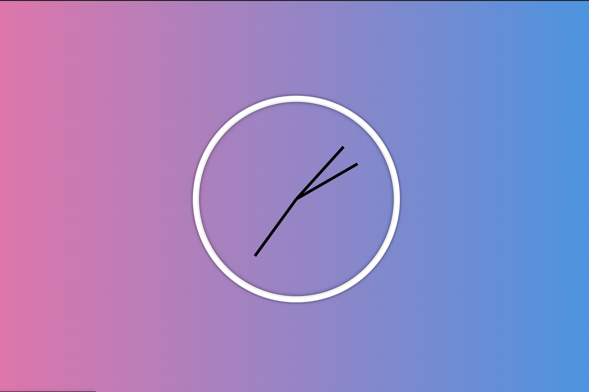

# EXERCISE 08: Clock Workshop

## Description

This exercise explain how to read an anolog clock, then we will build one together.



---

## How to read an anolog clock

Reading an anolog clock can be dificult if you've never done so before, but it doesn't take long to learn. Let's start by taking a look at the parts of a clock. An anolog clock consists of 3 main parts, the short hand (Hour Hand) and the long hand (Minutes Hand), and a Seconds Hand. Clock will often have numbers on the face to make it easier to read, but this is optional and you may com across a clock without numbers.

[How to Read an Analog Clock](https://www.youtube.com/watch?v=p5gXD70Fubc)

---

Now that you understand how to read a clock, let's build one.

### Setup

1. Go to [codepen.io](https://codepen.io/trending) and open a new Pen.

### Steps

1). Let start by adding some HTML. Copy and paste the following code snippet into the area on Code Pen, labeled `HTML`.

```html
<div class="clock">
      <div class="clock-face">
        <div class="hand hour-hand"></div>
        <div class="hand min-hand"></div>
        <div class="hand second-hand"></div>
      </div>
    </div>

```

Let's review some of the elements used in this code snippet.

### Div Element

```html
<div>

</div>
```

The `<div>` tag defines a division or a section in an HTML document.

The `<div>` tag is used as a container for HTML elements - which is then styled with CSS or manipulated with JavaScript.

The `<div>` tag is easily styled by using the class or id attribute.

Any sort of content can be put inside the `<div>` tag!

Note: By default, browsers always place a line break before and after the `<div>` element.

You may have noticed that clock face and hands are `<div>` elements. As we mentioned before `<div>` elements are containers. By default they're shapeless but by using CSS we can style them to look like whatever we want. You may have also noticed that each `<div>` element has a `class` attribute.

Multiple HTML elements can share the same class name.

The class attribute is often used to point to a class name in a style sheet. It can also be used by a JavaScript to access and manipulate elements with the specific class name.

---
