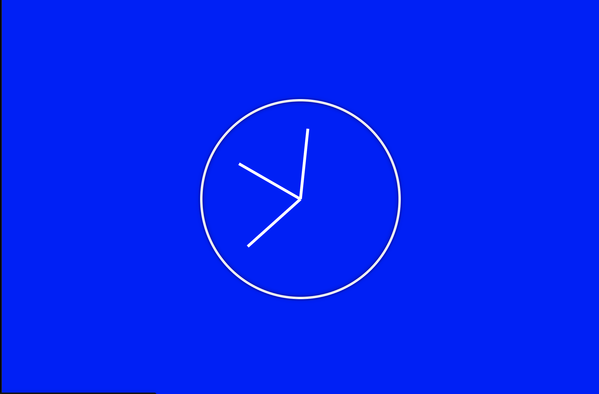

# EXERCISE 08: Clock Workshop

## Description

This exercise explains how to read an analog clock, then we will build one together.



## How to read an analog clock

Reading an analog clock can be difficult if you've never done so before, but it doesn't take long to learn. Let's start by taking a look at the parts of a clock. An analog clock consists of 3 main parts, the short hand (Hour Hand) and the long hand (Minutes Hand), and a Seconds Hand. Clocks will often have numbers on the face to make it easier to read, but this is optional and you may come across a clock without numbers.

[How to Read an Analog Clock](https://www.youtube.com/watch?v=p5gXD70Fubc)

***

Now that you understand how to read a clock, let's build one.

### Setup

1. Go to [codepen.io](https://codepen.io/trending) and open a new Pen.

### Steps

1\). Let's start by adding some HTML. Copy and paste the following code snippet into the area on Code Pen, labeled `HTML`.

```html
<div class="clock">
      <div class="clock-face">
        <div class="hand hour-hand"></div>
        <div class="hand min-hand"></div>
        <div class="hand second-hand"></div>
      </div>
    </div>
```

Let's review some of the elements used in this code snippet.

### Div Element

```html
<div>

</div>
```

The `<div>` tag defines a division or a section in an HTML document.

The `<div>` tag is used as a container for HTML elements - which are then styled with CSS or manipulated with JavaScript.

The `<div>` tag is easily styled by using the class or id attribute.

Any sort of content can be put inside the `<div>` tag!

Note: By default, browsers always place a line break before and after the `<div>` element.

You may have noticed that the clock's face and hands are `<div>` elements. As we mentioned before `<div>` elements are containers. By default they're shapeless but by using CSS we can style them to look like whatever we want. You may have also noticed that each `<div>` element has a `class` attribute.

Multiple HTML elements can share the same class name.

The class attribute often points to a class name in a style sheet.

***

Now let's add our style. Copy the following code snippet and paste it into the CSS section of your Code Pen.

```css
html {
  background-color:yellow;
  background-size: cover;
  font-family: "helvetica neue";
  text-align: center;
  font-size: 10px;
}

body {
  margin: 0;
  font-size: 2rem;
  display: flex;
  flex: 1;
  min-height: 100vh;
  align-items: center;
}

.clock {
  width: 30rem;
  height: 30rem;
  border: 2px solid white ;
  border-radius: 50%;
  margin: 50px auto;
  position: relative;
  padding: 6rem;
  box-shadow: 0 0 0 4px rgba(0, 0, 0, 0.1), inset 0 0 0 3px #efefef,
    inset 0 0 10px black, 0 0 10px rgba(0, 0, 0, 0.2);
}

.clock-face {
  position: relative;
  width: 100%;
  height: 100%;
  transform: translateY(-3px); /* account for the height of the clock hands */
}

.hand {
  width: 50%;
  height: 6px;
  background: white;
  position: absolute;
  top: 50%;
  transform-origin: 100%;
  transform: rotate(90deg);
  transition: all 0.05s;
  transition-timing-function: cubic-bezier(0.1, 2.7, 0.58, 1);
}
```

The CSS rules above determine the layout of the background, the clock face, the hand, etc.

Modify the following rules.

1. Find the CSS rule that makes the background color yellow, and change it to blue.

2. In the `clock` class, change the `border` from `2px` to `20px`.

3. Change the color of the hands to black instead of white.

4. Change the hour hand to red so it will be easier to identify.

Good job.

Now let's add the javascript.

```js
   /* Hands*/
      const secondHand = document.querySelector(".second-hand");
      const minuteHand = document.querySelector(".min-hand");
      const hourHand = document.querySelector(".hour-hand");
      /* End of Hands*/
      /* Time Function*/
      function setDate() {
        const now = new Date();
        const seconds = now.getSeconds();
        const secondsDegrees = (seconds / 60) * 360 + 90;
        secondHand.style.transform = `rotate(${secondsDegrees}deg)`;

        const minutes = now.getMinutes();
        const minutesDegrees = (minutes / 60) * 360 + 90;
        minuteHand.style.transform = `rotate(${minutesDegrees}deg)`;

        const hours = now.getHours();
        const hoursDegrees = (hours / 12) * 360 + 90;
        hourHand.style.transform = `rotate(${hoursDegrees}deg)`;
      }

      setInterval(setDate, 1000);

      setDate();
```

Javascript adds functionality to our projects and allows them to work as intended.
