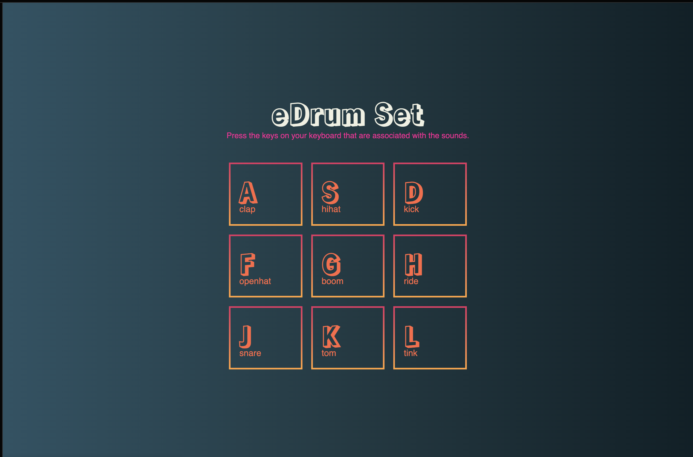

# EXERCISE 09: eDrum Set

## Description

For this exercise we will build a electronic drum set. Read the instructions below and add the code to the appropriate sections in Code Pen.



### How it works

We will use the letters `A,S,D,F,G,H,J,K,L` on our keyboard to play the sounds on our Drum set. Each key has a specific keycode. We will assign a unique sound to each key by using the keycode. For example, the keycode for `A` is `65`, the keycode for `S` is `83`, the keycode for `D` is `68`.

Let's get started.

### Setup

1. Go to [codepen.io](https://codepen.io/trending) and open a new Pen.

### Steps

1\). Let's add the initial HTML. Copy and paste the following code snippet into the area on Code Pen, labeled `HTML`.

```html
<div class="container">
<div>
  <h1>eDrum Set</h1>
  <p style="color:#FF0099;">Press the keys on your keyboard that are associated with the sounds.</p>
  <br>
  <div class="keys">
    <div data-key="65" class="key">
      <kbd>A</kbd>
      <span class="sound">clap</span>
    </div>
    <div data-key="83" class="key">
      <kbd>S</kbd>
      <span class="sound">hihat</span>
    </div>
    <div data-key="68" class="key">
      <kbd>D</kbd>
      <span class="sound">kick</span>
    </div>
  </div>
  <div class="keys">
    <div data-key="**" class="key">
      <kbd>F</kbd>
      <span class="sound">openhat</span>
    </div>
    <div data-key="**" class="key">
      <kbd>G</kbd>
      <span class="sound">boom</span>
    </div>
    <div data-key="**" class="key">
      <kbd>H</kbd>
      <span class="sound">ride</span>
    </div>
  </div>
  <div class="keys">
    <div data-key="**" class="key">
      <kbd>J</kbd>
      <span class="sound">snare</span>
    </div>
    <div data-key="**" class="key">
      <kbd>K</kbd>
      <span class="sound">tom</span>
    </div>
    <div data-key="**" class="key">
      <kbd>L</kbd>
      <span class="sound">tink</span>
    </div>
  </div>
</div>
</div>
<audio data-key="65" src="https://raw.githubusercontent.com/wesbos/JavaScript30/master/01%20-%20JavaScript%20Drum%20Kit/sounds/clap.wav"></audio>
<audio data-key="83" src="https://raw.githubusercontent.com/wesbos/JavaScript30/master/01%20-%20JavaScript%20Drum%20Kit/sounds/hihat.wav"></audio>
<audio data-key="68" src="https://raw.githubusercontent.com/wesbos/JavaScript30/master/01%20-%20JavaScript%20Drum%20Kit/sounds/kick.wav"></audio>
<audio data-key="70" src="https://raw.githubusercontent.com/wesbos/JavaScript30/master/01%20-%20JavaScript%20Drum%20Kit/sounds/openhat.wav"></audio>
<audio data-key="71" src="https://raw.githubusercontent.com/wesbos/JavaScript30/master/01%20-%20JavaScript%20Drum%20Kit/sounds/boom.wav"></audio>
<audio data-key="72" src="https://raw.githubusercontent.com/wesbos/JavaScript30/master/01%20-%20JavaScript%20Drum%20Kit/sounds/ride.wav"></audio>
<audio data-key="74" src="https://raw.githubusercontent.com/wesbos/JavaScript30/master/01%20-%20JavaScript%20Drum%20Kit/sounds/snare.wav"></audio>
<audio data-key="75" src="https://raw.githubusercontent.com/wesbos/JavaScript30/master/01%20-%20JavaScript%20Drum%20Kit/sounds/tom.wav"></audio>
<audio data-key="76" src="https://raw.githubusercontent.com/wesbos/JavaScript30/master/01%20-%20JavaScript%20Drum%20Kit/sounds/tink.wav"></audio>
  
```

The keycode for each key is represented by the `data-key` attribute. You may have noticed that there are some missing keycodes. Open [https://www.toptal.com/developers/keycode](https://www.toptal.com/developers/keycode) and press the letter `F`. The keycode for the letter `F` is `70`. Replace the `**` above the letter `F` in your HTML with the number `70`.

Do the same for the letters `G,H,J,K,L`

***

Now let's add our style. Copy the following code snippet and paste it into the CSS section of your Code Pen.

```css
@import url('https://fonts.googleapis.com/css2?family=Rampart+One&display=swap');

html {
 background: #0F2027;  /* fallback for old browsers */
background: -webkit-linear-gradient(to right, #2C5364, #203A43, #0F2027);  /* Chrome 10-25, Safari 5.1-6 */
background: linear-gradient(to right, #2C5364, #203A43, #0F2027); /* W3C, IE 10+/ Edge, Firefox 16+, Chrome 26+, Opera 12+, Safari 7+ */

}
p, .key {
  font-family: 'Asul', sans-serif;
  font-size: 0.9rem;
  color: #FF6743;
  text-align:center;
}

h1 {
  font-family: 'Rampart One', cursive;

;
  font-size: 3.2rem;
  color: #EFF0E2;
  line-height:0;
  text-align:center;
}

html, body {
  margin: 0;
  padding: 0;
  width: 100vw;
  height: 100vh;
}
.container {
  display: flex;
  height: 100%;
  flex-direction: column;
  justify-content: center;
}

.keys {
  display: -webkit-box;
  display: -moz-box;
  display: -ms-flexbox;
  display: -webkit-flex;
  display: flex;
  -webkit-justify-content: center;
  justify-content: center;
  -webkit-align-content: center;
  align-content: center;
}

.key {
  border: .2rem;
  border-style: solid;
  -moz-border-image: -moz-linear-gradient(top, #E03163 0%, #FFA33A 100%);
  -webkit-border-image: -webkit-linear-gradient(top, #E03163 0%, #FFA33A 100%);
  border-image: linear-gradient(to bottom, #E03163 0%, #FFA33A 100%);
  border-image-slice: 1;
  margin: 0.5rem;
  font-size: 1.5rem;
  padding: 2rem 0rem 1rem 1rem;
  transition: all .07s ease;
  width:7rem;
  text-align: left;
  background: transparent;
}

.playing {
  transform: scale(1.3);
  border-color: #FA9141;
  box-shadow: 0 0 1rem #FA9141;
  background: rgba(255,255,255,0.05);
}

.playing .sound {
  color: #FA9141;
}

kbd {
  display: block;
  font-size: 3rem;
  font-family: 'Rampart One', cursive;
font-family: 'Rampart One'
  color: #EFF0E2;
  font-weight: 600;
  line-height:0.7em;
}

.sound {
  font-size: 1rem;
}
```

Now let's add the javascript.

```js
   function playSound(e) {
    const audio = document.querySelector(`audio[data-key="${e.keyCode}"]`);
  const key = document.querySelector(`.key[data-key="${e.keyCode}"]`);
    if(!audio) return; //stop function from running
    audio.currentTime = 0;
    audio.play();
    key.classList.add('playing');
  };

function removeTransition(e){
  if (e.propertyName !== 'transform') return;
  this.classList.remove('playing');
};

const keys = document.querySelectorAll('.key');

keys.forEach(key => key.addEventListener('transitionend', removeTransition));

window.addEventListener('keydown', playSound);
```

Javascript adds functionality to our projects and allows them to work as intended.
