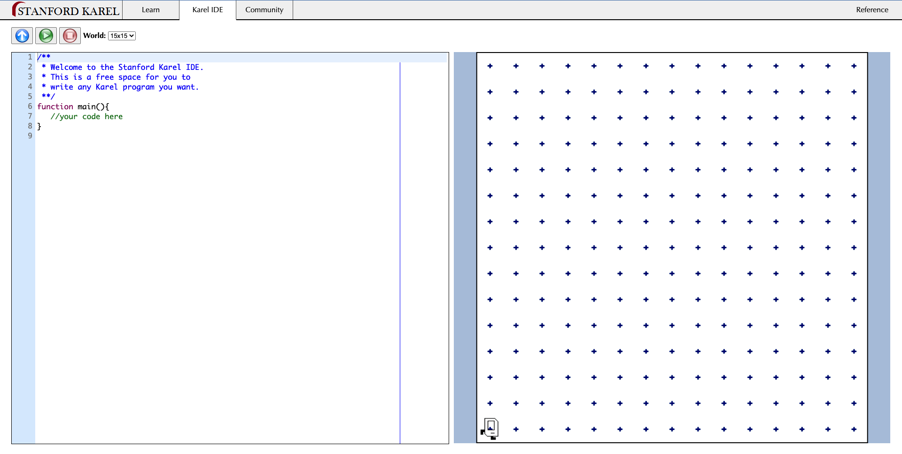
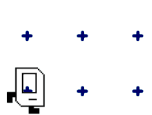
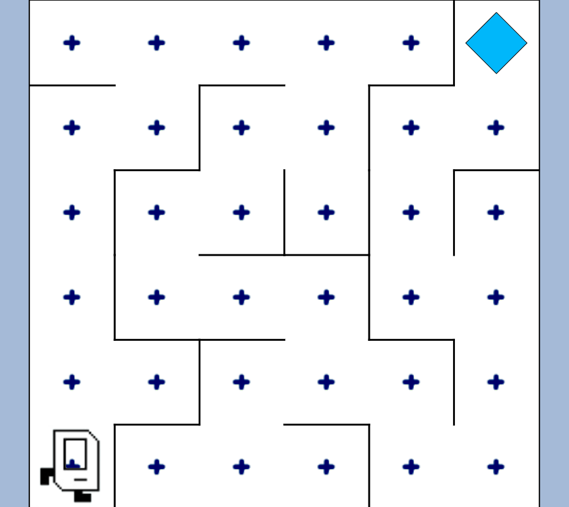

# EXERCISE 09: Karel the Robot

## Description

As you know, HTML provides the content for the page. CSS provides the layout and structure of the page. Javascript provides the functionality. We write functions to carry out the set of actions we want completed. In this exercise we'll learn about writing functions using [Karel the Robot](https://stanford.edu/~cpiech/karel/ide.html) from Stanford. Karel is an IDE (Intergrated Development Environment), that allows us to write the code that makes the robot carry out a function.



---

### Let's get started

1\). Go to [Stanford Karel](https://stanford.edu/~cpiech/karel/ide.html).

You'll see a function like this.

```js
function main(){
   //your code here
}
```

The example above is a function declaration. To create a function, you first write the keyword `function`, next is the name of the function. In this case it's `main`. Followed by

```js
(){

}
```

The space between the two curly brackets is where your code will go. The code will run, whenever the **green play button** is clicked.


This executes the function.



---

### The Functions

Karel has a `Reference` sheet that has some buit-in commands, conditions, loops , etc. The commands are

1. Move
2. Turn Left
3. Pick Beeper
4. Put Beeper

There's also

1. Turn right
2. Turn around
3. Paint Corner

---

Now let's give it a try.
1\) Let's start by changing the `World` to `4 x 4` to make it easier to work with.
2\) We'll move Karel to the top-right corner of the page, by adding the following lines in the function and clicking Run.

```
move();
move();
move();
turnLeft();
move();
move();
move();
```

Great!

Now try this on your own.

Get back to the starting position in the bottom left corner, but  go diagonally.

---

Great!

Now that you know how to use the robot. Switch the `World` to `maze` and solve the maze.



Great job! You're on your way to becoming a programmer.
