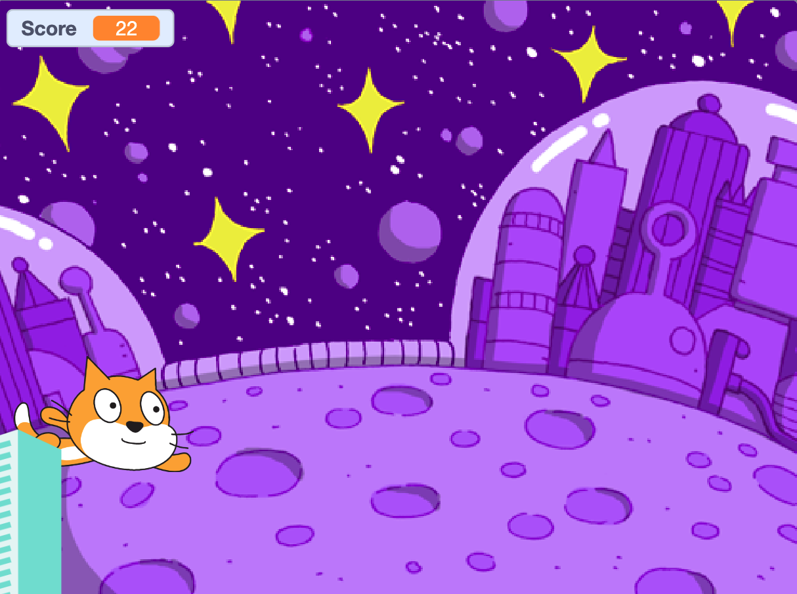
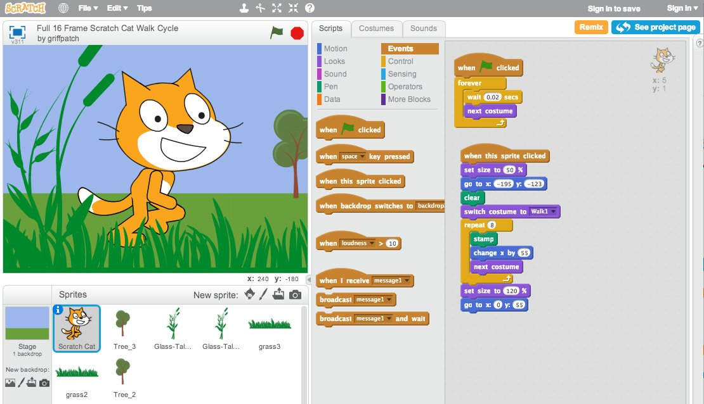
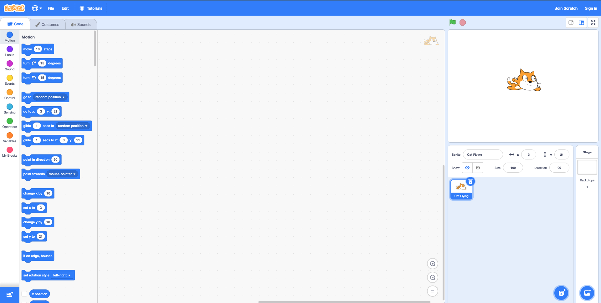
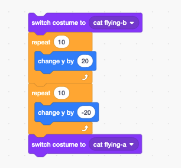
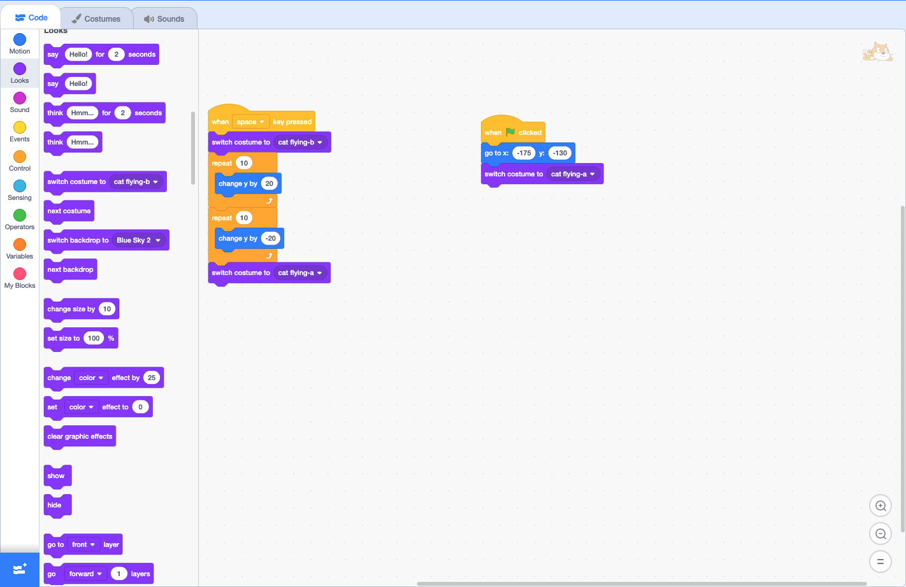
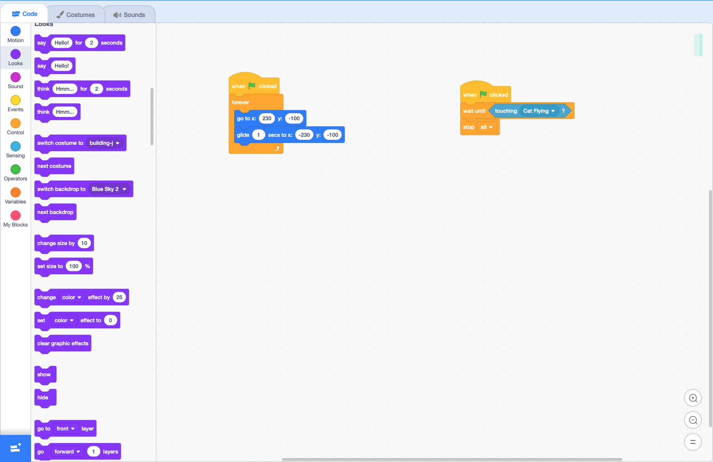

# EXERCISE 12: Scratch Workshop

## Description

This exercise introduces [Scratch](https://scratch.mit.edu/). Let's gets familiar with using the program by building a simple game where our character flies, and dodges obstacles along the way.

## What is Scratch?

Scratch is a educational tool designed to teach students the fundamentals of programming. It consists of a high-level block-based visual programming language and website and was createds by MIT. Students are able to create projects on the website using a block-like interface.

---

## Let's get started

### Choose a Sprite and make it fly

1\. Go to [Scratch](https://scratch.mit.edu/) and click the Start Creating button.

2\. Click the Choose a Sprite button in the buttom right corner.

3\. Select the Cat Flying Sprite.

4\. Delete the original Sprite by clicking on the "x" on the image of the Sprite.

5\. Click the Choose a Backdrop button, and select Blue Sky 2.

Awesome. Now that we have our character and the backdrop, let's add some functionality.

6\. On the left side of the page under the `Code` tab, you will see a section titled `Motion`. Find the block titled `change y by 10` and drag it to the main section of the page. Change the `10` to `20`.

7\. Go to the `Control` section and drag the block titled `repeat 10` to the center of the page. Put the  `change y by 20` inside of the `repeat 10`.

Now when you click on your function, your character will fly higer than before.

You may have noticed that your character goes up, but doesn't come back down. Let's fix that.

8\. Right click on your block of code and select `Duplicate`.

Now you have 2 blocks of code that carry out the same function.

9\. Change the `20` in the second block of code to `-20` and attach the block together.

You should end up with something that looks like this:

Now when you click on the block of code, your character will move up and then down.

10\. Go to the `Looks` section, and find the block titled, `switch costume to cat flying-b`. Drag and drop `switch costume to cat flying-b` to the top of the code block. Drag and drop another `switch costume to cat flying-b` to the bottom of the code block, then change `-b` to `-a`. You should end up with the following:

Now when you click on your block of code, your character will not only fly higher, but it will also change it's postion while it flies higher.

11\. Go to the `Events` section and look for the block of code titled `when space key pressed` and drag it to the top of the code block.

Now your code will execute whenever you click the space key.

Test it out. Press the space key and watch out cat fly.

We'll need to add the block of code that will set our character in position when the game starts.

12\. Go to the `Events` section and look for the block of code titled `when green flag clicked` and drag it to the center of the page. This will begin a new code block.

13\. Click the `Motion` section and drag the block of code titled `go to x: _ y: _` and place it under the `when green flag clicked` block.

14\. Change the `x` to `-175` and the `y` to `-130`.

15\. Go to the `Looks` section and drag the `switch costume to cat flying-b` code block and place it under the rest of the code section.

16\. Change the `-b` to `-a`.

Awesome, Now when you click the `green flag` you chracter will always reset to its starting position.

---

### Add the Obstacle

Now lets add an obstacle to make our game a little challenging.

1\. Click on the `Choose a Sprite` button and select `Buildings`.

2\. Go to the `Events` section under the `Code` tab and click and drag the `when green flag clicked` code block to the center of the page. This wis trigger some commands when the flag is clicked.

3\. Go to the `Control` section and select the `forever` code block and attach it to the `when green flag clicked` code block.

4\. Grab the `Building` sprite and place it in the far right corner of the page, and about half way down so that only half the building will be showing.

5\. Go to the `Motion` section, and grab the `go to x: _ y: _`. Place it inside the `forever` block. Change the `x` to `230` and the `y` to `-100`.

Whenever the `green flag` is clicked, the `Building` sprite will automatically go to that starting position.

6\.  Grab the `Building` sprite and place it in the far right corner of the page, and about half way down so that only half the building will be showing.

7\. Grab the `glide 1 secs to x: _ y: _` code block and place it in the `forever` block under the `go to x: 230 y: -100`.

8\. Change the `secs` to `.80`, change the `x` to `-230`, change the `y` to `-100`.

9\. Let's also change the size of the `Buildings` to `80`.

If you click the `green flag` you'll see the `Buildings` zooming towards your character in an endless loop.

You can dodge the `Buildings` by pressing the space key.

Great! Your game technically works, but you can't loose. Let's add a bit more challenge by stopping the game if the `Buildings` touch your character.

---

### Stop the game

1\. Go to the `Events` section and drag the `when green flag clicked` code block to the center of the page.

2\. Go to the `Control` section and drag the `wait until` code block, and plce it under the `when green flag clicked` code block.

3\. Go to the `Sensing` section and select the option titled `touching mouse-pointer` and place it in the empty section of the `wait until` code block.

4\. Change the `mouse-pointer` to `Cat Flying`.

5\. Finally, go to the `Control` section and drag the `stop all` code block and place it under the other blocks. You should end up with the following:

---

### Keep Score

Now we need to keep score.

1\. In the `Variables` section, click the button called `Make a Variable`. Name the variable `Score`.

2\. Drag the `change my variable by 1` code block and place it under the `switch costume to cat flying-a` block (The block of code that's executed when the space key is pressed). Change `my variable` to `Score`.

3\. Drag the `Set my variable to 0` code block and place it under the `switch costume to cat flying-a` block (The block of code that's executed when the green flag is clicked). Change `my variable` to `Score`.

---
Awesome! Now you have a working game. But don't stop there. Give the bonus material a try.

### Bonus

1\. Switch the Backdrop when the user gets a score above `10` and then again at `20`, and then again at `30`.

2\. Add a sound for the character whenever it jumps.
